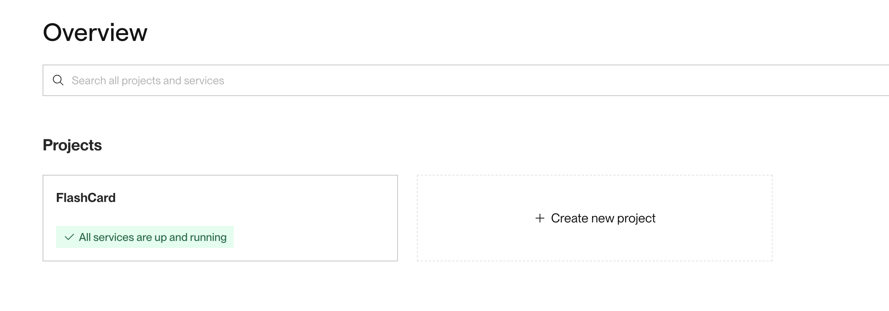
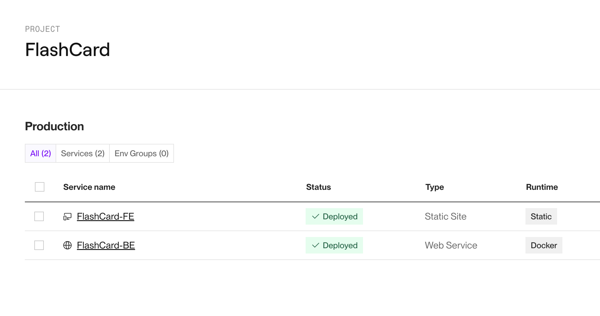
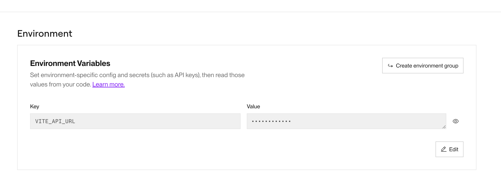

# **AI-Powered FlashCard**

AI-Powered FlashCard is my flash card webpage showing the power of AI in automated content generation. this project is full-stack . All created from scratch.

## Features

- User Authentication: Signup, login, and logout functionality for users.
- Flash Card Management: Users can create, read, update, and delete flashcards, each flashcard consists of a word/phrase and its meaning.
- Study Mode:A simple interface for users to review their flashcards in study mode.
- Responsive Design: Optimized for small screen devices.
- AI-Powered: Auto generate description and image for visual representation.

## Technical Features

- Modular component architecture.
- React Router for routing.
- tsConfig, eslint and prettier configured for best practices and code style consistency.
- User credential hashed for storage and comparation.
- AI-powered with OpenAI API.

## Tech

- 
- 
- 
- 

## Roadmap

- [x] Prepare MongoDB schema and services
- [x] User Management
- [x] User Authentication
- [x] Flash Card Management (CRUD)
- [x] Flash Card AI Integrate
- [x] Study Mode
- [x] UI Integration with Ant Design

## Video demo
**1. Simple Register and Login**
[Video demo link](./flash-card-be/public/video/register-login-simple.mp4?raw=true)
```bash
https://github.com/andrewtran2507/flash-card-fe-api-ai/blob/main/flash-card-be/public/video/register-login-simple.mp4
```
**2. The flash card CRUD**
[Video demo link](./flash-card-be/public/video/flash-card-crud.mp4?raw=true)
```bash
https://github.com/andrewtran2507/flash-card-fe-api-ai/blob/main/flash-card-be/public/video/flash-card-crud.mp4
```
**3. BE AI Prompt**
[Video demo link](./flash-card-be/public/video/register-login-simple.mp4?raw=true)
```bash
https://github.com/andrewtran2507/flash-card-fe-api-ai/blob/main/flash-card-be/public/video/ai-promt.mp4
```
**4. End User Study Mode**
[Video demo link](./flash-card-be/public/video/user-study-mode.mp4?raw=true)
```bash
https://github.com/andrewtran2507/flash-card-fe-api-ai/blob/main/flash-card-be/public/video/user-study-mode.mp4
```

## Development (for local)

- Frontend and Backend requires [Node.js](https://nodejs.org/) **v20+** to start on local.

- Prepare an OpenAI API key by visiting this site [Platform OpenAI](https://platform.openai.com/)

- Install the dependencies and devDependencies.

```sh
npm i
```

- Create an .env file using the env.template and input the required (missing) variables.

- and start the server

```sh
npm run dev
```

## Deploy

- Both Frontend and Backend can be hosted on [Render](https://render.com/)
- Create a new project 
- Create 2 services for FE and BE 
- Choosing the repo you are using to store FE and BE code seperately
- Add Enviroment varible according to the env.template file 
- Wait for it to deploy and Done
